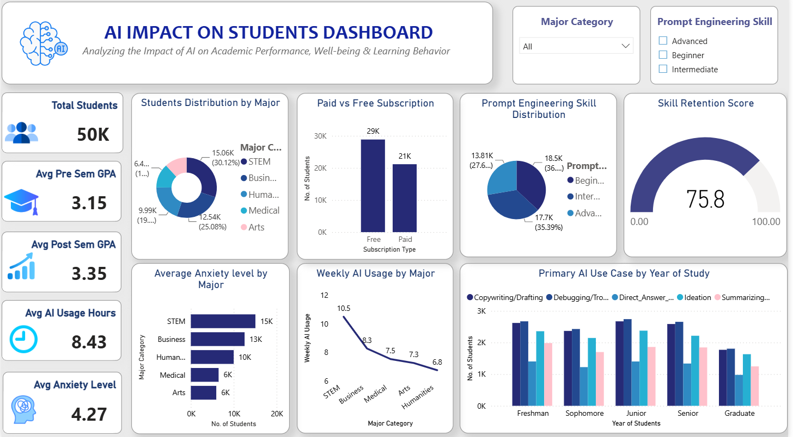

# 🎓 AI Impact on Students Dashboard

## 📌 Project Overview

The **AI Impact on Students Dashboard** is an interactive Power BI project that analyzes how Artificial Intelligence influences students' academic performance, learning behavior, well-being, and AI adoption. The dashboard provides meaningful insights through interactive visualizations and KPIs, helping users explore trends across majors, study years, AI subscription types, and prompt engineering skill levels.

---

## 🎯 Objectives

- Analyze AI adoption among students.
- Compare academic performance before and after AI usage.
- Evaluate AI usage across different majors.
- Compare Free vs. Paid AI subscriptions.
- Analyze prompt engineering skill distribution.
- Monitor anxiety levels and skill retention.
- Explore AI use cases by year of study.

---

## 📊 Dashboard Highlights

### Key Performance Indicators (KPIs)

| Metric | Value |
|--------|------:|
| 👨‍🎓 Total Students | 50,000 |
| 📚 Average Pre-Sem GPA | 3.15 |
| 📈 Average Post-Sem GPA | 3.35 |
| ⏱ Average Weekly AI Usage | 8.43 Hours |
| 🧠 Average Anxiety Level | 4.27 |
| 🎯 Skill Retention Score | 75.8 |

---

## 📈 Dashboard Visualizations

- Students Distribution by Major (Donut Chart)
- Paid vs Free Subscription (Column Chart)
- Prompt Engineering Skill Distribution (Pie Chart)
- Skill Retention Score (Gauge Chart)
- Average Anxiety Level by Major (Bar Chart)
- Weekly AI Usage by Major (Line Chart)
- Primary AI Use Case by Year of Study (Clustered Column Chart)
- Interactive KPI Cards
- Dynamic Slicers

---

## 🎛 Interactive Filters

The dashboard includes interactive slicers for:

- Major Category
- Prompt Engineering Skill

These filters dynamically update all visualizations for better analysis.

---

## 📂 Dataset Information

| Property | Details |
|----------|---------|
| Dataset | AI Impact on Students |
| Records | 50,000 |
| File Format | Excel (.xlsx) |
| Visualization Tool | Microsoft Power BI Desktop |

---

## 💡 Key Insights

- Average Post-Sem GPA is higher than the Pre-Sem GPA.
- STEM students show the highest AI adoption.
- Most students use Free AI subscriptions.
- Prompt Engineering skills vary from Beginner to Advanced.
- Students across different study years use AI for various purposes, including Copywriting, Debugging, Direct Answers, Ideation, and Summarization.
- The dashboard highlights differences in anxiety levels and AI usage across academic majors.

---

## 🛠 Tools & Technologies

- Microsoft Power BI
- Microsoft Excel
- Power Query
- DAX
- Data Modeling

---

## 📷 Dashboard Preview


```md


```

---

## 📁 Repository Structure

```text
AI-Impact-on-Students-PowerBI-Dashboard/
│
├── AI_Impact_on_Students.xlsx
├── AI_Impact_on_Students_PowerBI_Dashboard.pbix
├── Dashboard.png
└── README.md
```
```

---

## 🚀 How to Use

1. Clone or download this repository.
2. Open the `AI-Impact-on-Students-PowerBI-Dashboard.pbix` file using Microsoft Power BI Desktop.
3. Refresh the dataset if required.
4. Explore the dashboard using the interactive slicers and visualizations.

---

## 🎯 Skills Demonstrated

- Data Cleaning
- Data Transformation
- Power Query
- DAX
- Data Modeling
- Dashboard Design
- Data Visualization
- Business Intelligence
- Interactive Reporting
- Data Storytelling

---

## 👩‍💻 Author

**Nandani Jaiswal**

Computer Engineering Student | Power BI Developer | Data Visualization Enthusiast

---

⭐ If you found this project useful, consider giving it a star!
